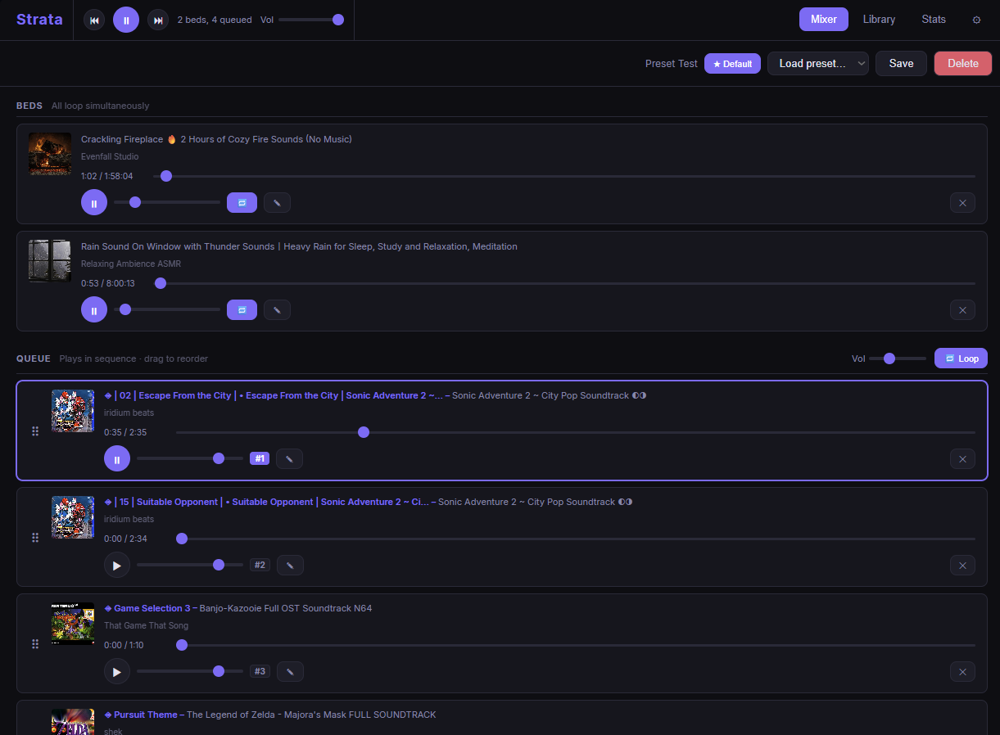
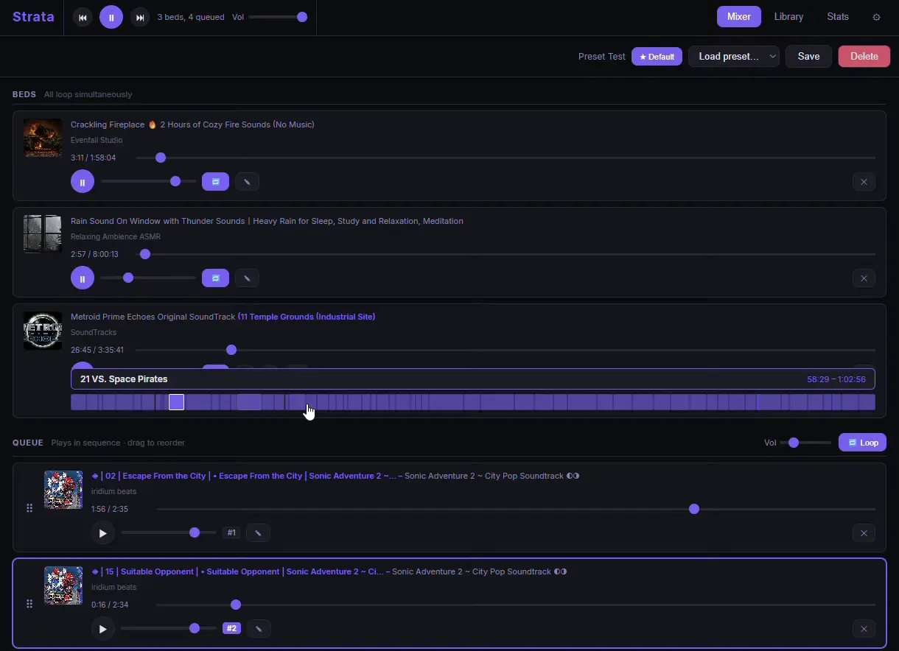
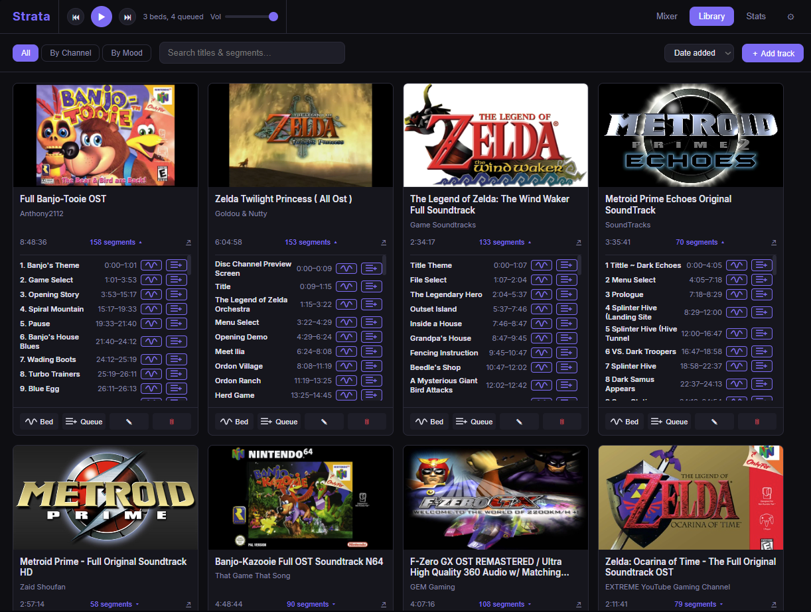
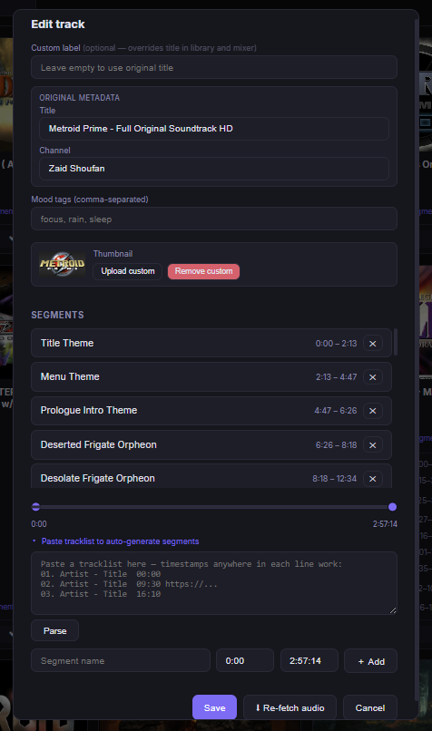

# Strata

> A self-hosted ambient sound mixer for layering music, soundscapes, and audio — runs in the browser, lives in your system tray.



---

## What it does

Strata lets you build a personal ambient audio environment. Load looping bed tracks (rain, music, ambience) at independent volumes, queue up longer pieces to play in sequence, and save the whole state as a preset you can recall instantly.

Audio comes from local files or any URL yt-dlp supports. Chapters and tracklist timestamps are parsed automatically into segments you can navigate track by track.

---

## Features

### Mixer



- **Beds zone** — multiple tracks loop simultaneously, each with independent volume
- **Queue zone** — sequential playback with drag-to-reorder, loop toggle, and master volume
- **Segment navigation** — `‹` / `›` buttons on each bed track jump between segments; the active chip highlights live as the track plays
- **Transport controls** — global ⏮ / ▶ / ⏭ with Spotify-style prev (restarts track if past 3 s, goes to previous otherwise)
- **Presets** — save and restore full mixer states; mark one as the startup default

### Library



- **Browse** — filter by All / By Channel / By Mood; sort by date, title, or play count
- **Search** — live filter across titles and segment names; matching cards expand their segment list automatically
- **Row expansion** — expanding segments on one card opens the whole grid row together
- **Stats** — listening time (all time / 30 days / 7 days), most played, recently played

### Track editor



- **Download from URL** — paste any URL; yt-dlp fetches audio + thumbnail in the background
- **Auto-segmentation** — chapters from yt-dlp and tracklist timestamps from descriptions are parsed automatically
- **Manual segments** — add, edit, reorder; paste a tracklist block and click **Parse** to auto-generate
- **Custom thumbnails** — upload your own image per track
- **Mood tags** — comma-separated with autocomplete from your corpus

---

## Installation

### Desktop app — Windows · macOS · Linux

Download the installer for your platform from the [**Releases**](https://github.com/Phazertron/Strata/releases) page:

| Platform | File |
|---|---|
| Windows | `Strata-Setup-x.x.x.exe` — wizard installer, installs per-user, no admin required |
| macOS | `Strata.dmg` — drag to Applications; right-click → Open on first launch (Gatekeeper) |
| Linux | `Strata-linux-x86_64.tar.gz` — extract and run `./Strata/Strata` |

After launch, Strata lives in the system tray (Windows/Linux) or menu bar (macOS). Click **Open Strata** to open the UI in your browser.

User data (tracks, presets, database) is stored in:
- **Windows:** `%APPDATA%\Strata`
- **macOS:** `~/Library/Application Support/Strata`
- **Linux:** `~/.local/share/Strata`

---

### Self-hosted (Docker)

The `docker-compose.yml` is written for a homelab running Traefik as a reverse proxy. Adjust the `Host` labels and volume path to match your setup.

```bash
docker compose up -d --build
docker compose logs -f strata
```

The container expects a `TZ` environment variable (e.g. in a `.env` file):

```
TZ=Europe/Rome
```

The media volume must be writable by the container. On the reference deployment it maps `/mnt/raid/strata/media` → `/media`.

---

### Run from source

```bash
# 1. Install dependencies
pip install -r strata/requirements.txt   # skip gunicorn on Windows/macOS
pip install -r desktop/requirements.txt

# 2. Generate placeholder icons (once)
python desktop/assets/generate_icon.py

# 3. Run
python desktop/main.py
```

Or without the tray, using the Flask dev server:

```bash
cd strata
MEDIA_ROOT=./media flask run   # Windows: set MEDIA_ROOT=.\media
```

See [desktop/README.md](desktop/README.md) for building a distributable installer from source.

---

## Stack

| Layer | Technology |
|---|---|
| Backend | Python 3.12, Flask 3, Waitress (desktop) / Gunicorn (Docker) |
| Audio download | yt-dlp + ffmpeg |
| Frontend | Vanilla JS, Web Audio API |
| Storage | Flat files (JSON + mp3 + thumbnail) + SQLite (telemetry) |
| Desktop wrapper | pystray, PyInstaller |
| Container | Docker, linux/arm64 |

## Project structure

```
strata/                 # Flask app (shared by both targets)
├── app.py              # API + download jobs + DB telemetry
├── wsgi.py             # Gunicorn entry point (Docker)
├── requirements.txt
├── Dockerfile
├── templates/index.html
└── static/
    ├── css/style.css
    └── js/app.js
desktop/                # Native desktop wrapper
├── main.py             # pystray entry point, starts waitress
├── requirements.txt
├── README.md           # Desktop build guide
├── assets/
│   ├── generate_icon.py
│   └── bin/            # Place yt-dlp + ffmpeg binaries here
└── build/
    ├── strata.spec     # PyInstaller spec
    └── installer.iss   # Inno Setup (Windows)
docker-compose.yml
```

Media layout:

```
<MEDIA_ROOT>/
├── tracks/<uuid>/
│   ├── audio.mp3
│   ├── thumbnail.jpg
│   └── meta.json
├── presets/<name>.json
└── telemetry.db
```

---

## Environment variables

| Variable | Default | Description |
|---|---|---|
| `MEDIA_ROOT` | `/media` | Root path for tracks, presets, and telemetry DB |
| `TZ` | — | Timezone for timestamp display |
| `FLASK_ENV` | `production` | Set to `development` for debug mode |

## API routes

| Method | Path | Description |
|---|---|---|
| `GET` | `/api/tracks` | List all tracks |
| `POST` | `/api/tracks` | Upload an audio file |
| `PATCH` | `/api/tracks/<id>` | Update track metadata |
| `DELETE` | `/api/tracks/<id>` | Delete track and all its files |
| `GET` | `/api/tracks/<id>/thumbnail` | Serve thumbnail |
| `GET` | `/api/tracks/<id>/audio` | Serve audio |
| `POST` | `/api/download` | Queue a yt-dlp download job |
| `GET` | `/api/jobs/<id>` | Poll download job status |
| `GET` | `/api/presets` | List presets |
| `POST` | `/api/presets` | Save a preset |
| `DELETE` | `/api/presets/<name>` | Delete a preset |
| `GET` | `/api/stats` | Listening time and play-count stats |
| `POST` | `/api/telemetry` | Record a play event |

## Segment auto-detection

When a track is downloaded, segments are built from (in order of preference):

1. **yt-dlp chapters** — from the video's native chapter markers
2. **Description parsing** — timestamps found in the description; supports `[00:00]`, `00:00`, `01:01:30`, with or without track numbers or trailing URLs

If description parsing yields more segments than native chapters, it wins. You can also paste a tracklist manually in the editor and click **Parse**.

---

## Disclaimer

Strata is a personal-use tool. You are responsible for ensuring that any audio you download complies with the terms of service of the source platform and applicable copyright law. The authors make no representations regarding the legality of downloading specific content.

---

## License

[MIT](LICENSE) © Claudio Bedini
